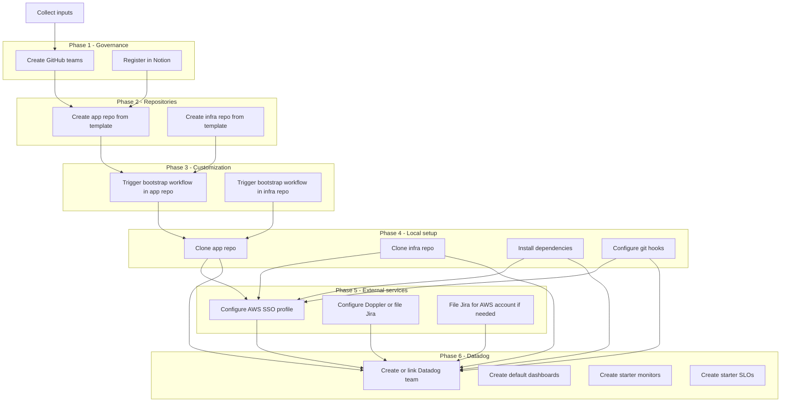
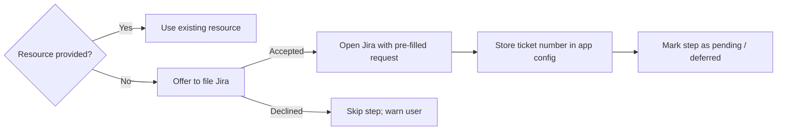
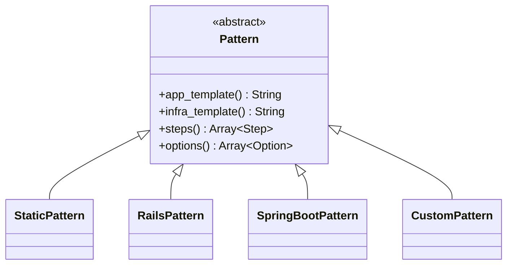

# Tech Spec - Application Bootstrap Command

| **Author(s):** | James Armes |
| -------------- | ----------- |
| **Date:**      | 2026-06-25  |
| **Status:**    | Draft       |

## Summary statement

Engineers at Code for America spend days or weeks manually wiring
together repositories, access controls, cloud accounts, and tooling
before writing a single line of product code. The `cfa-eng app`
command group solves this by providing an interactive wizard that
orchestrates every setup step — or delegates the ones requiring
elevated privileges — so a new application is fully bootstrapped in
under a day.

## Problem statement

Every new CfA application requires a consistent but manually executed
sequence of steps: creating application and infrastructure repositories
from a pattern, configuring GitHub team access, setting up a Doppler
project, configuring an AWS Identity Center SSO profile, and registering
the project in Notion. This process is spread across multiple systems,
requires tribal knowledge about our conventions, and has no single
source of truth for whether a project is fully set up.

The manual nature of this process produces inconsistency across projects
(divergent repo structures, missing access controls, ad-hoc naming),
slows onboarding, and creates risk when steps are missed or done out
of order. There is also a class of privileged operations — such as
provisioning a new AWS account or a new Doppler project — that
engineers cannot perform themselves, creating blockers with no clear
escalation path.

## Proposed solution

Add a new `app` subcommand group to the `cfa-eng` CLI. The primary
command, `cfa-eng app create`, guides an engineer through an
interactive wizard that collects all required inputs and then executes
(or delegates) every setup step. The CLI acts as an orchestrator: some
tasks run locally, some trigger GitHub Actions workflows, and others
open a Jira ticket for operations tasks the user cannot perform.

Application setup state is persisted locally (YAML, consistent with
the existing profile system) and in Notion's Technical Projects
database so the project is discoverable and resumable if interrupted.

Two top-level application types are supported: **static** and
**containerized**. Containerized apps additionally select a
**pattern** (Rails, Spring Boot, or Custom) that determines which
template repositories and setup steps apply. The pattern system is
designed to be extended as new frameworks are adopted.

### In scope

- [ ] `cfa-eng app create` interactive wizard with `--no-interactive`
  flag support
- [ ] Static application type (CloudFront, S3, Lambda)
- [ ] Containerized application type — Rails pattern
- [ ] Containerized application type — Spring Boot pattern
- [ ] Containerized application type — Custom/generic pattern
- [ ] GitHub repository creation from template repositories
- [ ] GitHub team creation and repository access configuration
- [ ] Local repository clone and dependency installation
- [ ] AWS Identity Center SSO profile configuration
- [ ] Doppler project configuration (existing project) or Jira
  request for new project creation
- [ ] Jira request flow for privileged operations (AWS account
  creation, Doppler project creation)
- [ ] Notion Technical Projects database entry creation
- [ ] Local app config YAML for state tracking and resumability
- [ ] `cfa-eng app list` and `cfa-eng app status` utility commands
- [ ] Datadog team creation
- [ ] Default Datadog dashboards per application type and pattern
- [ ] Starter Datadog monitors per application type and pattern
- [ ] Starter Datadog SLOs per application type and pattern
- [ ] Identification and documentation of appropriate Datadog
  defaults for each type and pattern
- [ ] Containerized infrastructure template repository with CI/CD
  workflows
- [ ] Static infrastructure template repository with CI/CD workflows
- [ ] Static application template repository with CI/CD workflows
- [ ] Rails application template repository with CI/CD workflows
- [ ] Spring Boot or TBD-framework application template repository
  _(stretch goal)_

### Out of scope

- AWS account provisioning (handled by operations via Jira)
- Doppler project provisioning (handled by operations via Jira)
- Infrastructure configuration beyond repository creation
- Python and JavaScript application patterns (future work, use Custom pattern
  for now)
- Migrating existing projects into the system retroactively
- CI/CD pipeline configuration (assumed to be part of templates)

### Risks & mitigations

| Identified risk                                                          | Proposed mitigation                                                                                                       |
| ------------------------------------------------------------------------ | ------------------------------------------------------------------------------------------------------------------------- |
| Building 4+ template repos and the CLI wizard in parallel may overload Milestone 1 | Staff template and CLI work as parallel tracks; agree on the bootstrap workflow interface contract early so both can proceed independently |
| GitHub API rate limits when creating repos and teams in sequence         | Batch API calls; surface clear error messages and allow resuming from the failed step                                     |
| Jira ticket request flow creates manual bottlenecks for new projects     | Document SLA expectations; consider async polling to detect when tickets are resolved                                     |
| Doppler and AWS account provisioning delays block engineers past day one | Allow setup to proceed without these resources; mark steps as "pending" and provide a resume path                         |
| Pattern extensibility design locks in early assumptions                  | Define a clean `Pattern` interface before building Milestone 2; validate with a second pattern before declaring it stable |

## Implementation details

### Command structure

```
cfa-eng app create [options]   # Interactive bootstrap wizard
cfa-eng app list               # List known projects (from local cache)
cfa-eng app status <name>      # Show step-by-step setup status
```

All subcommands follow the existing Thor pattern used by `bastion` and
`profile`. Business logic is delegated out of command classes into
dedicated classes under `lib/cfa_eng_cli/app/`.

### Interactive wizard flow

The wizard is structured as a sequence of prompt groups. When
`--no-interactive` is passed, every required value must be supplied
as a flag; missing values cause an immediate, descriptive error.

```
1. Application metadata
   - Name (slug, e.g. "ccap-il") — used to derive all resource names
   - Display name
   - Description
   - Product area / owning team

2. Application type
   - Static
   - Containerized

3. Pattern (containerized only)
   - Rails
   - Spring Boot
   - Custom

4. Optional features
   - OIDC / Okta authentication (CloudFront + ALB)
   - Worker container (containerized)
   - Aurora PostgreSQL database (containerized; default: yes)

5. Repository configuration
   - App repo name (default: codeforamerica/<name>)
   - Infra repo name (default: codeforamerica/<name>-infra)

6. GitHub teams
   - Engineering team name (default: <name>-eng)
   - Admin team name (default: <name>-admin)

7. AWS configuration
   - Existing AWS account ID, or request creation via Jira
   - AWS region (default: us-east-1)
   - Local SSO profile name (default: <name>)

8. Doppler configuration
   - Existing Doppler project name, or request creation via Jira

9. Datadog configuration
   - Existing Datadog team name, or request creation via Jira
   - Preview the default dashboards, monitors, and SLOs that will
     be created for the selected type and pattern

10. Review summary → confirm
```

### Task execution model

Setup tasks execute in phases. Tasks within a phase that have no
inter-dependencies are run concurrently. Each task records its
outcome to the local app config YAML so the wizard can resume from
the last successful step if interrupted.



### Privileged operation delegation

When a user cannot perform an operation themselves, the CLI detects
this by checking whether an existing resource was provided. If none
was provided, the wizard offers to file a Jira ticket pre-populated
with the required details.



The ticket number is stored in the local app config so `cfa-eng app
status` can surface it alongside the step state. A future enhancement
could poll Jira to detect when tickets are resolved and prompt the
user to resume.

Current operations that require this flow:

- **AWS account creation**: user lacks permission to create AWS
  accounts in Identity Center
- **Doppler project creation**: user lacks permission to create
  top-level Doppler projects
- **Datadog team creation**: to be confirmed during M1 research;
  may require admin privileges depending on Datadog org settings

### Pattern extensibility

Each application pattern is a Ruby class that implements a common
`Pattern` interface. The CLI selects the pattern at runtime based on
user input and calls its defined steps.



Each pattern declares:

- **`app_template`** — GitHub template repository for the application
  code (e.g., `codeforamerica/template-app-rails`)
- **`infra_template`** — GitHub template repository for OpenTofu
  infrastructure (e.g., `codeforamerica/template-infra-containerized`)
- **`steps`** — ordered list of setup step classes to execute
- **`options`** — pattern-specific configuration options surfaced in
  the wizard (e.g., Rails-specific gems, Java version)

Adding a new pattern (e.g., Python/FastAPI) requires only adding a
new `Pattern` subclass and a corresponding pair of template
repositories. No changes to wizard orchestration code are needed.

### Repository customization via GitHub Actions

Each template repository ships a `bootstrap.yaml` GitHub Actions
workflow. After the CLI creates a new repository from its template,
it triggers a `workflow_dispatch` event on that workflow, passing the
collected configuration as inputs. The workflow handles all
repo-specific customization (file renaming, placeholder substitution,
initial commit). Offloading this to GitHub Actions keeps the CLI thin
and makes customization logic auditable and independently testable.

The `bootstrap.yaml` interface (inputs and expected behaviour) is
agreed upon before template and CLI work split into parallel tracks,
so both can proceed independently without blocking each other.

Required workflow inputs (passed by the CLI):

| Input             | Description                          |
| ----------------- | ------------------------------------ |
| `app_name`        | Application slug                     |
| `display_name`    | Human-readable application name      |
| `team_name`       | GitHub engineering team name         |
| `aws_account_id`  | Target AWS account ID (may be blank) |
| `doppler_project` | Doppler project name (may be blank)  |
| `enable_oidc`     | Whether OIDC/Okta is enabled         |
| `enable_worker`   | Whether a worker container is used   |
| `enable_db`       | Whether Aurora PostgreSQL is used    |

### Default Datadog resources

The specific defaults are identified and documented as part of
Milestone 1. The table below captures the intended scope; exact
thresholds and metric names are determined during that research.

> [!NOTE]
> Defaults marked "TBD" require investigation in M1. All thresholds
> should be treated as starting points — teams are expected to tune
> them for their application.

#### All applications

| Resource  | Description                                                                |
| --------- | -------------------------------------------------------------------------- |
| Team      | Datadog team linked to the GitHub engineering team                         |
| Dashboard | Infrastructure overview, scoped to the application — panels vary by type   |

#### Static applications

| Resource  | Default                                                               |
| --------- | --------------------------------------------------------------------- |
| Dashboard | CloudFront request rate, error rate, cache hit ratio, p99 latency; Lambda invocations, error rate, p99 duration; S3 request count |
| Monitors  | CloudFront 5xx error rate; Lambda error rate; Lambda p99 duration     |
| SLOs      | Availability — CloudFront 5xx rate < threshold over 30 days           |

#### Containerized applications (all patterns)

| Resource  | Default                                                                          |
| --------- | -------------------------------------------------------------------------------- |
| Dashboard | ECS CPU/memory utilization, task count; ALB request rate, p99 latency, 5xx rate; CloudFront metrics |
| Dashboard | Aurora CPU, connection count, replication lag _(if Aurora enabled)_              |
| Dashboard | ECS worker CPU/memory; pattern-specific queue metrics _(if worker enabled)_      |
| Monitors  | ECS CPU > threshold; ECS memory > threshold; ALB 5xx rate > threshold; ECS task count below desired |
| Monitors  | Aurora connection count, CPU _(if Aurora enabled)_                               |
| SLOs      | Availability — ALB 5xx rate < threshold over 30 days                            |
| SLOs      | Latency — ALB p95 response time < threshold over 7 days                         |

#### Rails pattern (additional)

| Resource  | Default                                                                         |
| --------- | ------------------------------------------------------------------------------- |
| Dashboard | APM web request throughput, error rate, p95/p99 latency (via `ddtrace`)         |
| Dashboard | Sidekiq queue depth, job failure rate _(if worker enabled)_                     |
| Dashboard | Database query p95 latency                                                      |
| Monitors  | APM error rate > threshold; APM p99 response time > threshold                   |
| Monitors  | Sidekiq queue depth > threshold _(if worker enabled)_                           |

#### Spring Boot pattern (additional)

| Resource  | Default                                                                         |
| --------- | ------------------------------------------------------------------------------- |
| Dashboard | JVM heap usage, GC pause time; APM web request throughput, error rate, p95 latency (via `dd-java-agent`) |
| Monitors  | JVM heap usage > threshold; APM error rate > threshold; APM p99 > threshold     |

#### Custom pattern

No APM or application-level defaults are created. Infrastructure
monitors and dashboards (ECS, ALB, Aurora) are created as with other
containerized patterns. Teams are expected to add application-level
observability manually.

### Local state and resumability

App configuration and setup state are stored in
`~/.codeforamerica/apps/<name>.yaml`, parallel to the existing profile
system. The YAML records the collected inputs and the status of each
task (`pending`, `running`, `complete`, `failed`, `deferred`).

```yaml
name: ccap-il
display_name: IL CCAP
type: containerized
pattern: rails
repos:
  app: codeforamerica/ccap-il
  infra: codeforamerica/ccap-il-infra
teams:
  eng: ccap-il-eng
  admin: ccap-il-admin
aws:
  account_id: "123456789012"
  region: us-east-1
  profile: ccap-il
doppler:
  project: ccap-il
  jira_ticket: ~
datadog:
  team: ccap-il
  jira_ticket: ~
  dashboard_ids:
    - abc-123-def
  monitor_ids:
    - 1234567
  slo_ids:
    - xxxxxxxxxxxxxxxxxxxxxxxxxxxxxxxx
steps:
  create_github_teams: complete
  register_notion: complete
  create_app_repo: complete
  create_infra_repo: complete
  bootstrap_app_repo: complete
  bootstrap_infra_repo: complete
  clone_app_repo: complete
  clone_infra_repo: complete
  install_dependencies: complete
  configure_git_hooks: complete
  configure_aws_profile: complete
  configure_doppler: complete
  create_datadog_team: complete
  create_datadog_dashboards: complete
  create_datadog_monitors: complete
  create_datadog_slos: complete
```

If `cfa-eng app create` is interrupted, re-running it with the same
app name will load the existing config, skip completed steps, and
continue from the first non-complete step.

### Notion integration

The CLI uses the `ntn` CLI tool to create and update an entry in the
existing Technical Projects Notion database at project creation time.
The entry records the project name, repos, type/pattern, status, and
links to the Jira tickets for any deferred operations.

No new Notion database is required. If additional structured data is
needed (e.g., per-project AWS account IDs for audit purposes), a
supplementary "Engineering Projects" database can be created in a
future iteration.

### GitHub integration

The CLI shells out to the `gh` CLI for all GitHub operations. This
leverages engineers' existing `gh` authentication and avoids managing
a separate OAuth flow.

Key `gh` operations:

- `gh repo create --template <template> --private <name>` — create
  repo from template
- `gh api orgs/codeforamerica/teams -f name=<team>` — create team
- `gh workflow run bootstrap.yaml --repo <repo> -f key=value` —
  trigger customization workflow

### Milestones & deliverables

- **Milestone 1** (3–4 weeks): Template repositories and manual
  process documentation
  - Metrics & deliverables
    - Four template repositories exist and are usable manually:
      containerized infra, static infra, static app, and Rails app
      — each with a `bootstrap.yaml` GitHub Actions workflow
    - Runbooks document the complete manual setup process for each
      application type, covering every step the CLI will eventually
      automate
    - The `bootstrap.yaml` interface contract (inputs, behaviour) is
      agreed upon and documented, enabling CLI and template work to
      proceed in parallel in later milestones
    - _Stretch:_ A fifth template repository exists for Spring Boot
      or another TBD framework
  - Tasks
    - Define and document the `bootstrap.yaml` workflow interface
      contract (inputs, expected behaviour, outputs)
    - Build containerized infrastructure template repository
    - Build static infrastructure template repository
    - Build static application template repository
    - Build Rails application template repository
    - _Stretch:_ Build Spring Boot (or TBD) application template
      repository
    - Write runbook: setting up a new static application
    - Write runbook: setting up a new containerized Rails application
    - Publish runbooks to Notion alongside the template repos
    - Research and document default Datadog resources (dashboards,
      monitors, SLOs) for each application type and pattern;
      confirm whether Datadog team creation requires admin privileges

- **Milestone 2** (6–8 weeks): CLI wizard — static app support
  - Metrics & deliverables
    - An engineer can run `cfa-eng app create`, select the static
      type, and have both repositories created, teams configured,
      repos cloned, and an AWS SSO profile configured
    - `cfa-eng app list` and `cfa-eng app status` are functional
    - Local YAML state and Notion registration work end-to-end
    - `--no-interactive` flag fully supported
  - Tasks
    - Define `App`, `Pattern`, and `Step` base classes and interfaces
    - Implement `StaticPattern` with associated steps
    - Implement the interactive wizard (Thor prompts)
    - Implement GitHub team and repo creation via `gh`
    - Implement GitHub Actions workflow dispatch for repo
      customization
    - Implement AWS SSO profile writer (`~/.aws/config`)
    - Implement local app config YAML read/write
    - Implement Notion project registration via `ntn`
    - Add `cfa-eng app create`, `list`, and `status` commands
    - Implement Datadog team creation or Jira delegation
    - Implement default static app Datadog dashboards, monitors,
      and SLOs via the Datadog API

- **Milestone 3** (4–6 weeks): Containerized apps — Rails pattern
  - Metrics & deliverables
    - An engineer can run `cfa-eng app create` for a Rails app and
      complete all steps including Doppler integration or Jira
      delegation
    - Jira request flow works for both Doppler and AWS account
      creation
    - Resumability works: re-running after an interruption skips
      completed steps
  - Tasks
    - Implement `RailsPattern` (Rails template available from M1)
    - Implement Doppler project configuration step
    - Implement Jira ticket request flow for privileged operations
    - Implement step resumability (load state, skip complete steps)
    - Implement default containerized and Rails-specific Datadog
      dashboards, monitors, and SLOs

- **Milestone 4** (3–4 weeks): Spring Boot and Custom patterns
  - Metrics & deliverables
    - Pattern extensibility is validated with two patterns using
      the same step infrastructure
    - Spring Boot and Custom patterns produce working bootstrapped
      projects
    - Spring Boot template built here if not completed as M1 stretch
  - Tasks
    - Build Spring Boot application template if not done in M1
    - Implement `SpringBootPattern`
    - Implement `CustomPattern`
    - Implement Spring Boot-specific Datadog dashboards and monitors
    - Write pattern developer guide for future additions (including
      guidance on defining pattern-specific Datadog defaults)

- **Milestone 5** (2–3 weeks): Hardening and observability
  - Metrics & deliverables
    - `cfa-eng app status` surfaces Jira ticket links and pending
      steps clearly
    - Partial failures provide actionable recovery instructions
    - All new commands have unit and integration test coverage
  - Tasks
    - Error handling and rollback guidance for each step
    - `cfa-eng app status` Jira ticket status display
    - Full test coverage for wizard, patterns, and steps

### Security & privacy

The CLI writes to `~/.aws/config` and `~/.codeforamerica/apps/`. No
secrets are stored in these files; they contain only profile names,
account IDs, and step status.

Doppler credentials and AWS secrets are never handled by the CLI.
Engineers authenticate to Doppler and AWS independently using those
tools' own auth flows (`doppler login`, `aws sso login`).

GitHub operations use the engineer's existing `gh` session. The CLI
never stores or transmits GitHub tokens.

The Notion integration uses `ntn`'s existing authentication. No new
credentials are introduced.

Jira ticket creation, if done via the Jira API in a future iteration,
should use a service account token stored in Doppler and injected at
runtime — not hardcoded or stored on disk.

## Further reading

1. [cfa-eng-cli repository][cfa-eng-cli]
1. [Thor CLI framework][thor]
1. [GitHub CLI (`gh`) documentation][gh-docs]
1. [Doppler CLI documentation][doppler-cli]
1. [ntn Notion CLI][ntn]
1. [AWS Identity Center SSO configuration][aws-sso]

## Question log

| Asked by | Question | Answer |
| -------- | -------- | ------ |
|          |          |        |

[aws-sso]: https://docs.aws.amazon.com/cli/latest/userguide/cli-configure-sso.html
[cfa-eng-cli]: https://github.com/codeforamerica/cfa-eng-cli
[doppler-cli]: https://docs.doppler.com/docs/cli
[gh-docs]: https://cli.github.com/manual/
[ntn]: https://github.com/NotionX/ntn
[thor]: https://github.com/rails/thor
